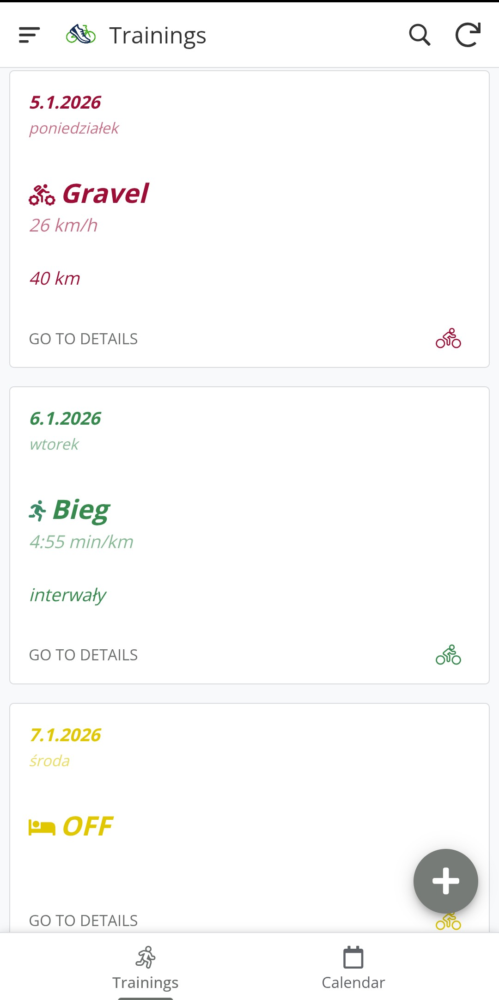
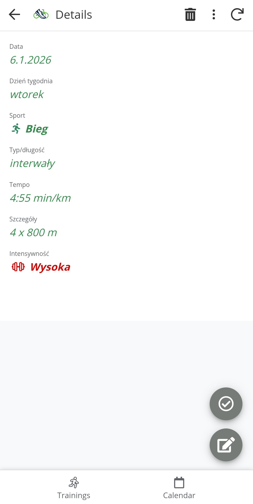
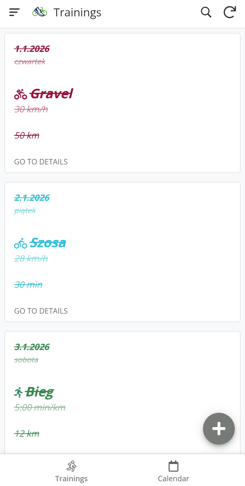
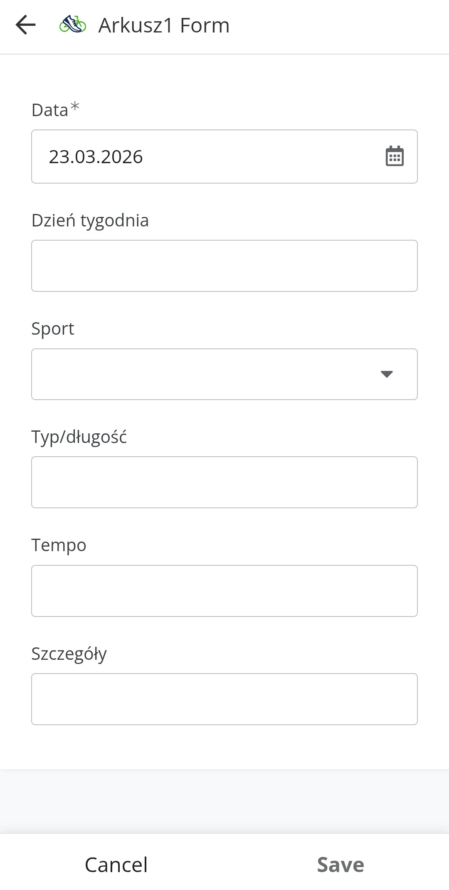
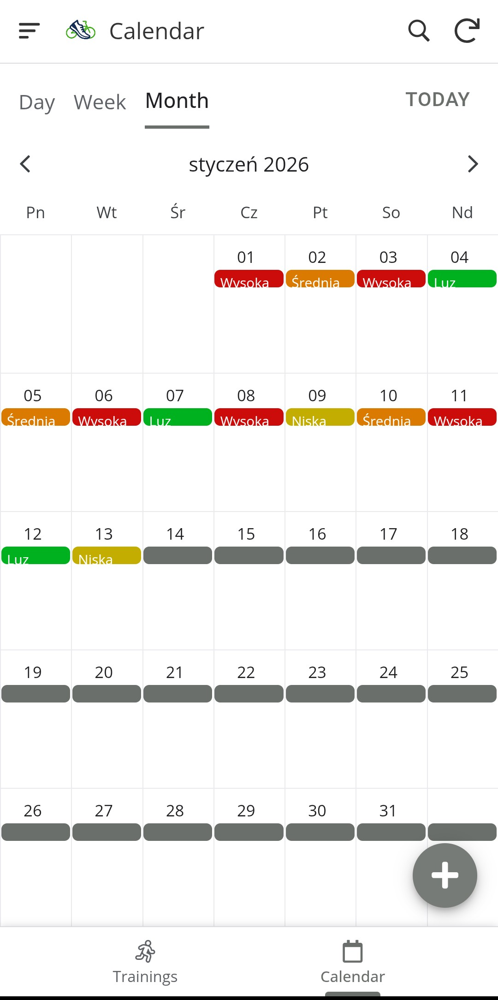

# 🏃‍♂️ Training Planner (AppSheet + Google Sheets)

Aplikacja no-code do planowania treningów zbudowana w **AppSheet** na bazie **Google Sheets**, oferująca widok kafelków treningowych, szczegóły aktywności, śledzenie realizacji oraz wizualizację intensywności w kalendarzu.

## Opis projektu

Aplikacja umożliwia przeglądanie, realizację oraz zarządzanie planem treningowym. Dane źródłowe przechowywane są w arkuszu Google Sheets, a interfejs użytkownika został zbudowany w AppSheet.

Każdy trening jest reprezentowany jako kafelek, który zawiera podstawowe informacje oraz umożliwia przejście do szczegółów.

---

## Jak to działa

1. Plan treningowy tworzony jest w **Google Sheets**
2. **AppSheet** synchronizuje dane i generuje interfejs aplikacji
3. Użytkownik korzysta z aplikacji do:
   - przeglądania treningów
   - oznaczania ich jako ukończone
   - dodawania nowych aktywności

---

## Struktura danych (Google Sheets)

Arkusz zawiera następujące kolumny:

- **Data**  
- **Dzień tygodnia**  
- **Sport**   
- **Typ/długość**   
- **Tempo**   
- **Szczegóły**  
- **Intensywność**   
- **Status ukończenia**

  
---

## Funkcjonalności aplikacji

### Widok treningów (kafelki)
- Lista treningów w formie czytelnych kart
- Kolorystyka zależna od typu aktywności
- Szybki podgląd najważniejszych informacji

### Szczegóły treningu
- Kliknięcie w kafelek otwiera widok szczegółowy
- Wyświetlane są wszystkie dane treningu:
  - tempo
  - dystans / czas
  - szczegóły treningu
  - intensywność
    

### Oznaczanie ukończenia
- Możliwość zaznaczenia treningu jako wykonanego
- Ukończony trening jest:
  - przekreślony
  - wizualnie oznaczony w liście
    

### Dodawanie treningu
- Formularz do dodawania nowych aktywności
- Pola:
  - data
  - sport
  - typ/długość
  - tempo
  - szczegóły
- Dane zapisywane bezpośrednio do Google Sheets
  

### Widok kalendarza
- Miesięczny widok treningów
- Każdy dzień oznaczony kolorem intensywności:
  - 🔴 Wysoka
  - 🟠 Średnia
  - 🟡 Niska
  - 🟢 Luz
- Szybki przegląd obciążenia treningowego
  

---

## Zastosowanie

- planowanie treningów sportowych
- kontrola realizacji planu
- analiza intensywności
- budowanie regularności treningowej

## Możliwe rozszerzenia

- statystyki tygodniowe / miesięczne
- wykresy postępów
- powiadomienia o treningach

---

## Autor
Antonina Frąckowiak
